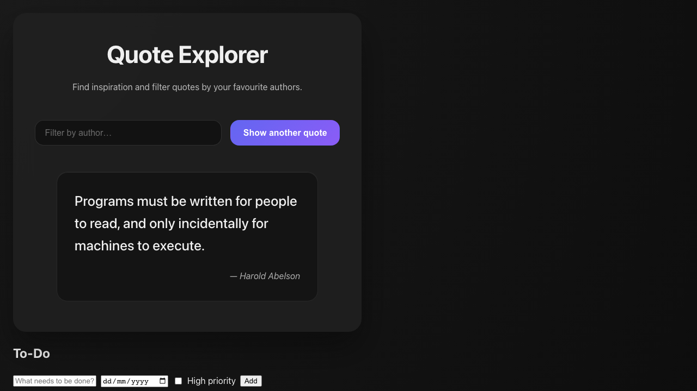
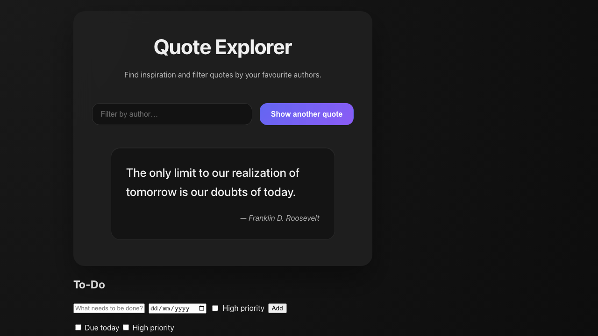

# Week 2 CLI Projects - Hardening Complete

> How to review me:
> - Go to GitHub Actions → latest run for `review-packet` on `development` or your PR.
> - Download the artifact named `review-packet`.
> - Open `review-artifacts/index.html` for the Coverage Index and links (Backend + UI Coverage sections).

### PR Spec requirement
- Every PR must include a line in the description with a link to the specification or Linear ticket:
  - `Spec: https://...` (Linear issue URL or external spec doc)
- PR titles must start with the Linear key, for example: `DEV-123: Short description`.

## Week 2 Status

✅ **CLI Hardening Complete**: HELLO, STOPWATCH, TEMP-CONVERTER CLIs hardened with validation, error paths, and comprehensive testing
✅ **Coverage Targets Exceeded**: All CLIs meet or exceed workbook requirements (≥50-60%)
✅ **Review Packet**: Per-app HTML coverage structure implemented
✅ **Test Isolation**: All tests passing in full suite

## Frontend

Placeholder for Week 3 UI work. UIs will reuse the hardened CLI cores and ship with accessibility labels, keyboard support, and documented coverage.

<p align="center">
  
</p>

<p align="center">
  
</p>

<p align="center">
  
</p>

<p align="center">
  
</p>

### Installation
- **Clone the repository**
- **Navigate into the project directory**
- **Install dependencies**

```bash
npm install
```

### Running Tests
Run the full test suite:

```bash
npm test
```

### Usage Examples

#### Hello CLI
- **Default greeting**

```bash
node src/hello/index.js
```

- **Greeting with a name**

```bash
node src/hello/index.js Alice
```

- **Greeting with a name and --shout flag**

```bash
node src/hello/index.js Alice --shout
```

- **Run via npx (after building/publishing or with `npm link`)**

```bash
npx . hello-cli Alice --shout
```

#### Stopwatch CLI
- **Start the stopwatch (resets any previous state)**

```bash
node src/stopwatch/index.js start
```

- **Record a lap**

```bash
node src/stopwatch/index.js lap
```

- **Run via npx**

```bash
npx . stopwatch-cli start
npx . stopwatch-cli lap
```

#### Temperature Converter CLI
- **Convert Celsius to Fahrenheit**

```bash
node src/temp-converter/index.js 100 --from C --to F
```

- **Convert Fahrenheit to Celsius**

```bash
node src/temp-converter/index.js 32 --from F --to C
```

- **Example that would cause an error (identical units)**

```bash
node src/temp-converter/index.js 100 --from C --to C
```

- **Run via npx**

```bash
npx . temp-cli 100 --from C --to F
```

If invalid or identical units are provided, the CLI will print an error message.
Sync test performed on September 23, 2025.

#### Expense CLI
- Add an expense

```bash
node src/expense/index.js add --amount 12000 --category transport
```

- List expenses

```bash
node src/expense/index.js list
```

- Total (optionally filter)

```bash
node src/expense/index.js total
node src/expense/index.js total --category food
node src/expense/index.js total --month 3
```

- Error example (non-numeric amount → non‑zero exit)

```bash
node src/expense/index.js add --amount abc --category food
```

#### To‑Do CLI
- Add; list; toggle; remove (spec flags with backward compatibility)

```bash
# Spec flags
node src/todo/index.js add "Buy milk" --due 2025-09-24 --priority high

# Legacy flags (still supported)
node src/todo/index.js add "Pay bills" --highPriority --dueToday

# Other commands
node src/todo/index.js list
node src/todo/index.js toggle 0
node src/todo/index.js remove 0
```

- Error examples

```bash
# Missing text → non-zero exit
node src/todo/index.js add

# Bad date format → non-zero exit
node src/todo/index.js add "Task" --due 2025/09/24

# Bad priority value → non-zero exit
node src/todo/index.js add "Task" --priority urgent
```

#### Quote CLI
- Default random

```bash
node src/quote/index.js
```

- By author (case‑insensitive)

```bash
node src/quote/index.js --by "Maya Angelou"
```

- Error example (author not found → non‑zero exit)

```bash
node src/quote/index.js --by "Unknown Author"
```

## Coverage Index
The Coverage Index and per-app HTML reports are packaged in the GitHub Actions artifact named `review-packet` (on the `development` branch and PRs). Download the artifact and open `review-artifacts/index.html`. The Coverage Index now includes dedicated UI coverage reports alongside the CLI summaries.

### UI Coverage (To‑Do and Stopwatch)

- UI To‑Do coverage is included under `ui-coverage-todo/` in the `review-packet` artifact.
- UI Stopwatch coverage is included under `ui-coverage-stopwatch/`.
- Open `review-artifacts/index.html` and click the respective links.
